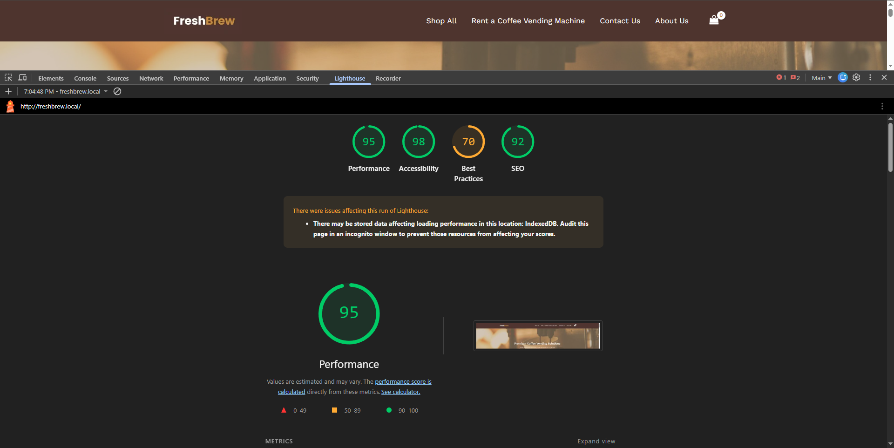
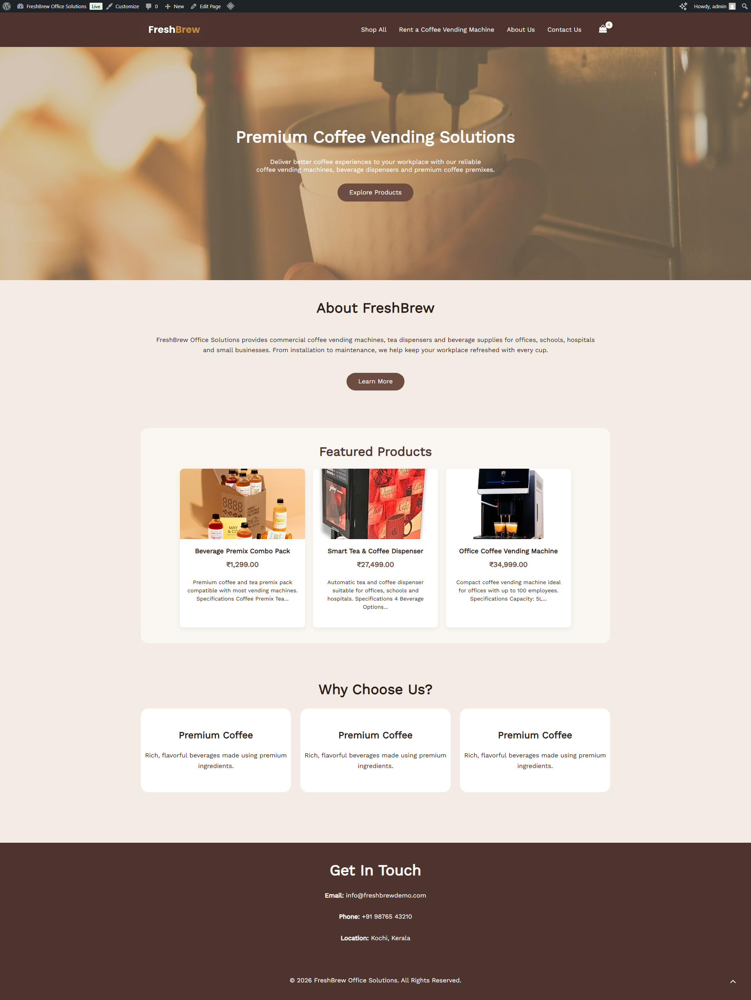
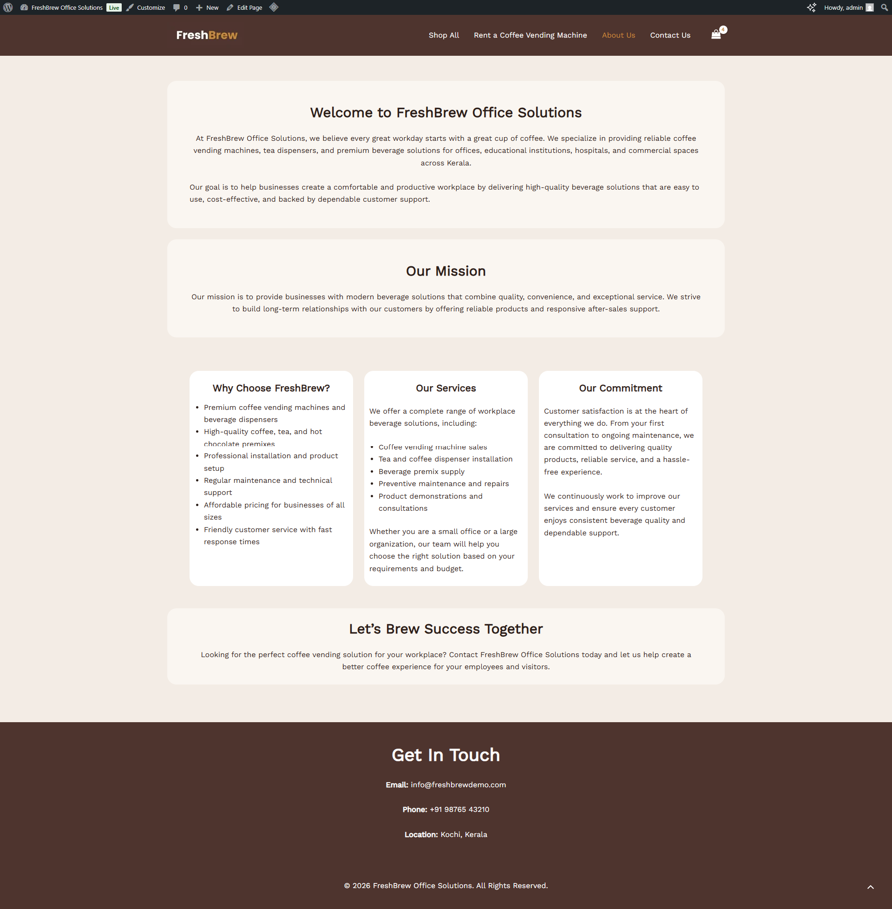
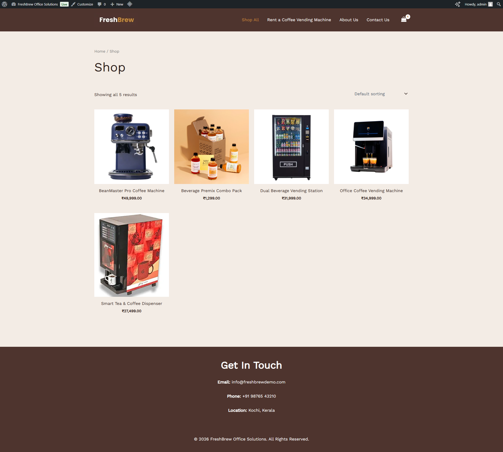
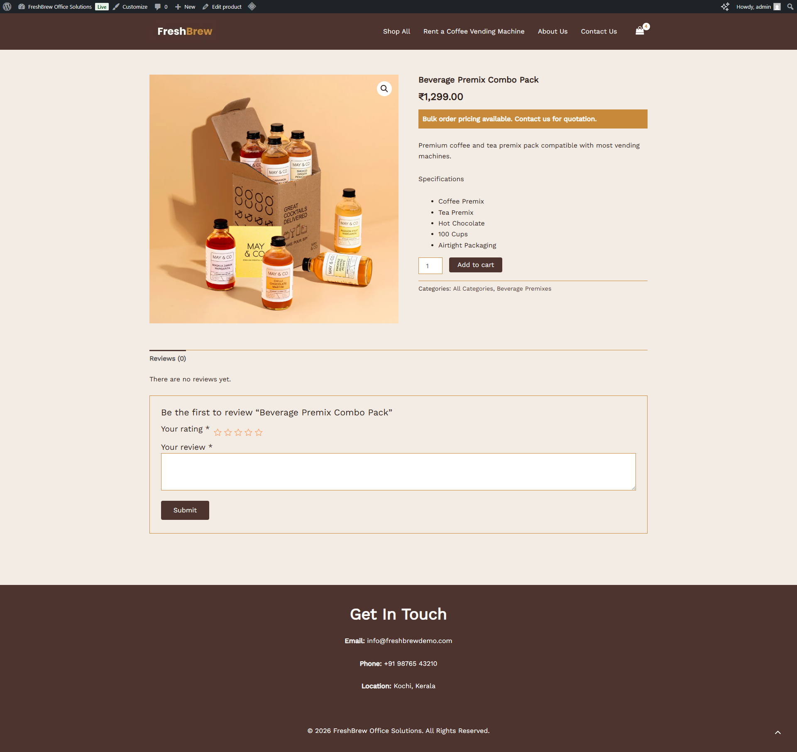
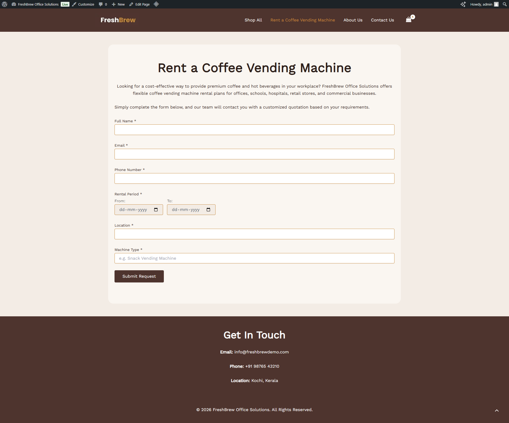
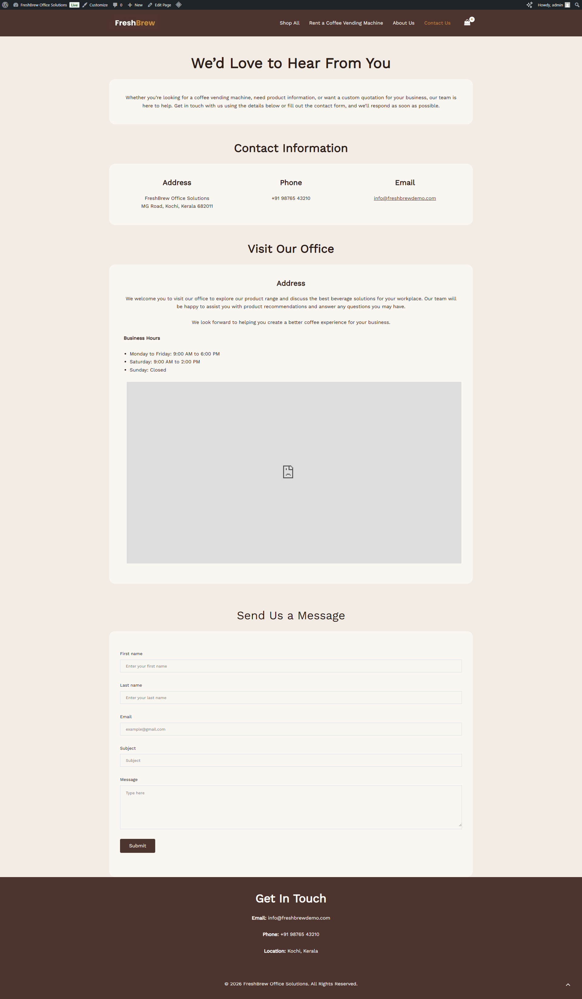

# WordPress & WooCommerce Assessment

## Project Overview

This project is a demo eCommerce website built using **WordPress** and **WooCommerce** for a **Vending Machine Business**. The website demonstrates WordPress development, WooCommerce customization, responsive design, and custom PHP/MySQL functionality.

---

# Website Information

**Business Type:** Vending Machine Business

**Platform:** WordPress Version 7.0.1

**E-commerce:** WooCommerce

**Theme:** Astra (Child Theme)

---
# Local Project Setup

Follow the steps below to set up the project in your local development environment.

## Prerequisites

Ensure your environment meets the following requirements:

-   PHP 8.0 or later
    
-   Apache or Nginx
    
-   MySQL 5.7+ or MariaDB 10.4.28+
    
-   WordPress-compatible web server environment (e.g., XAMPP, Laragon, Docker)
    

## Installation Steps

1.  **Clone the project repository**
    
    Clone the Git repository to your local web server directory.
    
2.  **Create a Database**
    
    Create a new MySQL/MariaDB database for the project.
    
3.  **Import the Database**
    
    Import the provided SQL database dump into the newly created database.
    
    > **Note:** The database dump (`.sql`) has been shared separately via email along with this submission.
    
4.  **Configure WordPress**
    
    Update the `wp-config.php` file with your local database credentials:
    
    -   Database name
        
    -   Database username
        
    -   Database password
        
    -   Database host
        
5.  **Configure the Local Domain**
    
    Create a virtual host with the following domain:
    
    ```
    freshbrew.local
    ```
    
    If you choose to use a different local domain, update the **WordPress Address (Site URL)** and **Site Address (Home URL)** in the database (or via the WordPress admin if accessible) to match your chosen domain.
    
6.  **Start the Web Server**
    
    Start Apache/Nginx and MySQL, then open the website in your browser using your configured local domain.
    

## Notes

-   The project source code is maintained in Git and can be updated by pulling the latest changes from the repository.
    
-   The SQL database dump included with the submission contains all demo products, pages, settings, and custom plugin data required to run the project successfully.
> **Note:** The complete **`uploads`** directory is included in the repository. After completing the installation steps, there is **no need to re-upload any images or media files**, as all media assets are already available.

## Important

#### Troubleshooting: 404 Errors & Broken Links After Setup

If you just cloned the repository, connected your database, and got the site running locally, you might experience the following issues:

* The homepage loads fine, but clicking any internal link results in a **404 Page Not Found** error.
* Plugins like Wordfence or LiteSpeed Cache display a dashboard warning that they are "not optimized" or missing configuration.

### Why this happens
We intentionally ignore the `.htaccess` file in Git. The `.htaccess` file generated by WordPress and security plugins contains absolute, hardcoded file paths specific to the original developer's computer (e.g., `D:\XAMPP\...`). 

If you pulled that file, your local server would immediately crash with a **Fatal 500 Internal Server Error**. Keeping it out of Git prevents this crash, but it means your local setup is temporarily missing its routing rules.

### The Fix
You just need to force WordPress to generate a fresh `.htaccess` file tailored specifically to your computer's directory structure. 

1. Log in to your local WordPress admin dashboard (`/wp-admin`).
2. In the left-hand menu, navigate to **Settings** > **Permalinks**.
3. Scroll to the very bottom of the page and click **Save Changes**. *(You do not need to actually change any of the radio button selections).*

> **Note:** Clicking "Save Changes" immediately generates a brand new `.htaccess` file for your local environment. Your 404 errors will disappear, and plugins like Wordfence and LiteSpeed will automatically inject their required rules into the new file in the background.

---

# Pages Implemented

- ✅ Home
- ✅ About
- ✅ Products (Shop)
- ✅ Single Product
- ✅ Contact

---

# WooCommerce Setup

The following WooCommerce features were configured:

- WooCommerce installation and configuration
- Shop page
- Product pages
- Shopping cart
- Checkout page
- Product categories
- Product images
- Product pricing
- Product descriptions
- Product specifications

---

# Products Added

- Added multiple demo products with the following details:
  - Product image
  - Product title
  - Product price
  - Short description
  - Product specifications
---

# Responsive Design
The website is fully responsive and has been optimized for the following devices:
-   Desktop
-   Tablet
-   Mobile

The layout automatically adapts to different screen sizes, providing a consistent and user-friendly experience across all supported platforms.

---

# Contact Form

A contact form has been implemented on the **/contact-us** page using the **Gutena Forms** plugin.

The form is configured to send emails via **SMTP**, ensuring reliable email delivery. For the contact form to function correctly, SMTP must be configured with valid mail server credentials.

---

# SEO Setup

SEO has been implemented using **Slim SEO**, a lightweight and easy-to-use WordPress SEO plugin.

The SEO implementation includes:

-   Custom page titles
-   Meta descriptions
-   Proper H1 heading usage
-   Proper H2 heading hierarchy

These SEO best practices have been applied across the website, including the Home page, category pages, product pages, and other key pages to improve search engine visibility and content structure.

---

# Performance Optimizations


The website has been optimized to improve loading speed and overall performance.

The following optimizations have been implemented:

-   Images have been compressed and converted to the WebP format where supported to reduce file size while maintaining quality.
-   Lazy loading is enabled for images, ensuring that images are loaded only when they enter the user's viewport.
-   Unused plugins and their associated scripts/styles have been removed to reduce unnecessary resource loading.
-   The website is built using the Astra theme without importing any starter templates, resulting in a lightweight and clean foundation.
-   Only essential plugins have been installed to minimize overhead and improve performance.
-   CSS and JavaScript assets have been kept to a minimum by avoiding unnecessary custom libraries.
-   Responsive images are used where applicable to deliver appropriately sized images based on the user's device.

These optimizations resulted in an overall **Lighthouse Performance Score of 95%**.

See the performance report:



---

# Security

Security best practices have been implemented throughout the website and custom plugin to improve overall application security.

-   **WordPress Core Updates:** The website is built on the latest stable version of WordPress to ensure that known security vulnerabilities are patched.
- **Wordfence Security:** The **Wordfence Security** plugin has been configured to provide an additional layer of protection. Key features enabled include:
--   Web Application Firewall (WAF)
--   Two-Factor Authentication (2FA)
--   Login Security
--   Rate Limiting for login attempts and API requests
--   Brute Force Protection
--   Malware Scanning
--   Live Traffic Monitoring
-   **Strong Administrator Credentials:** Administrator accounts use strong passwords to reduce the risk of unauthorized access.
-   **Frontend and Server-side Validation:** All custom form inputs are validated on both the client side (for improved user experience) and the server side to prevent invalid or malicious data from being processed.
-   **Input Sanitization:** All user-submitted data is sanitized before being stored in the database to protect against common attacks such as Cross-Site Scripting (XSS).
-   **Nonce Verification:** WordPress nonces are used to verify form submissions and protect against Cross-Site Request Forgery (CSRF) attacks.
 -   **API Authentication:** The custom REST API endpoint implemented for the project is protected using **WordPress Application Passwords**, ensuring that only authenticated requests can access the endpoint without exposing user credentials.
-   **Secure Database Operations:** All database interactions are performed using the WordPress Database API (`$wpdb`), with prepared statements and safe query methods used where applicable to help prevent SQL Injection attacks.
-   **Security Headers:** The following HTTP security headers have been implemented to enhance browser-side security:
    -   **Strict-Transport-Security (HSTS):** Forces browsers to communicate with the website over HTTPS.
    -   **Content-Security-Policy (CSP):** Restricts the sources from which scripts, styles, and other resources can be loaded, helping mitigate XSS attacks.
    -   **X-Frame-Options:** Prevents the website from being embedded in iframes, protecting against clickjacking attacks.
    -   **X-Content-Type-Options:** Prevents MIME type sniffing by browsers, reducing the risk of executing malicious files.
    -   **Referrer-Policy:** Controls the amount of referrer information shared with external websites, improving user privacy.
    -   **Permissions-Policy:** Restricts access to browser features such as camera, microphone, and geolocation unless explicitly permitted.

These measures provide a strong security foundation by protecting against common web application vulnerabilities while following WordPress development best practices.

---

# Backup & Deployment


### Backup

The website can be backed up using several approaches depending on the project requirements:

-   **Hosting Provider Backups:** Most hosting providers offer automated daily backups. This is the most commonly used approach in production environments due to its reliability and ease of restoration.
-   **WordPress Backup Plugins:** Plugins such as UpdraftPlus or All-in-One WP Migration can be used to create scheduled backups of the website files and database, and to restore them when required.
-   **Automated Database Backups:** A scheduled **cron job** can be configured to create database backups on a daily or weekly basis, depending on the project's requirements and the frequency of content updates.

### Deployment

The project source code is maintained using **Git** for version control.

The website can be deployed using one of the following approaches:

-   **Manual Git Deployment:** Pull the latest changes directly from the Git repository onto the server.
-   **CI/CD Deployment (Recommended):** Configure a **GitHub Actions** workflow to automatically build and deploy the latest code whenever changes are pushed to the repository. This approach provides a more reliable, repeatable, and automated deployment process and is the recommended solution for production environments.

For this assessment, the complete project source code is available in the Git repository, and the accompanying database dump can be imported to recreate the website with all demo content and custom functionality.

---

# Custom Development

## 1. Custom CSS


A dedicated custom stylesheet has been implemented as part of the **Custom Featured Products** plugin. The stylesheet is responsible for styling the featured products section displayed on the frontend through a custom shortcode.

The custom CSS includes:

-   Featured product card styling
-   Responsive grid layout
-   Button styling
-   Product information layout
-   Mobile and tablet responsive adjustments

**CSS File:**

`wp-content/plugins/custom-featured-products/assets/css/frontend.css`

---

## 2. PHP Customization


Multiple PHP customizations have been implemented to extend the default WordPress and WooCommerce functionality.

#### Custom Featured Products Plugin

A custom plugin was developed to display featured WooCommerce products on the frontend using a shortcode.

**Plugin Path:**

`wp-content/plugins/custom-featured-products`

**Key Features:**

-   Displays featured WooCommerce products via a shortcode
-   Custom product query using WooCommerce APIs
-   Dedicated frontend styling
-   Fully responsive product grid

#### Machine Rental Manager Plugin

A second custom plugin was developed to manage machine rental requests through a custom frontend form.

**Plugin Path:**

`wp-content/plugins/machine-rental-manager`

**Key Features:**

-   Custom rental request form
-   Form validation and sanitization
-   Stores rental requests in a custom MySQL table
-   Admin interface to manage submitted rental requests

#### WooCommerce Customization

The mandatory WooCommerce customization has also been implemented using a WooCommerce hook to display the following message below the product price on the single product page:

> **Bulk order pricing available. Contact us for quotation.**

---

# MySQL / Database Implementation

A custom database table was created to store machine rental requests.

## Purpose


On the **Machine Rental Manager** plugin, a dedicated custom database table is created during plugin activation using WordPress's `dbDelta()` function. Rental requests are stored in this table instead of the default WordPress tables, keeping business data separate from website content.

The plugin performs the following database operations:

-   Create the custom database table
-   Insert rental requests
-   Retrieve rental requests in the admin dashboard
-   Delete rental requests

All database operations use the **WordPress Database API** (`$wpdb`). User inputs are validated on both the frontend and server side, sanitized before storage, and database queries are executed securely using WordPress best practices to help prevent SQL injection and other common vulnerabilities.

---

# Plugin / API Integration


For the **Plugin/API integration**, I created a custom **Machine Rental Manager** plugin that provides a dedicated REST API for handling machine rental requests.

The plugin exposes the following custom endpoint:

-   `machine-rental/v1/submit`

This endpoint validates incoming rental requests and securely stores them in a custom `**machine_rentals**` database table.

The plugin supports two authentication methods:

-   **Nonce authentication** for requests originating from the website frontend.
-   **WordPress Application Passwords** for authenticated third-party integrations and external API clients.

To ensure secure and reliable data handling, the plugin implements:

-   Client-side validation
-   Server-side validation
-   Input sanitization before database storage
-   Secure database operations using the WordPress Database API (`$wpdb`)
-   Proper API success and error responses

In addition to the API, the plugin provides an **admin management interface** where administrators can view all submitted rental requests and update their status. Each request can be:

-   Approved
-   Rejected
-   Deleted
-   Pending
-   Contacted

This implementation demonstrates the development of a secure custom WordPress REST API, custom database management, and an administrative interface for managing machine rental requests.

---
## Mandatory PHP Customization

To satisfy the mandatory PHP customization requirement, I created an **Astra child theme** and implemented the customization in the child theme's `functions.php` file.

The `woocommerce_get_price_html` hook was used to append the following message directly below the product price on the single product page:

> **Bulk order pricing available. Contact us for quotation.**

This approach extends the default WooCommerce functionality without modifying any core WordPress or WooCommerce files, making the customization update-safe and maintainable.

**Implementation Path:**

`wp-content/themes/astra-child/functions.php` (around line 20)


## Screenshots

The following screenshots showcase the key pages and features implemented as part of the assessment.

### Home Page



---

### About Us



---

### Shop / Products



---

### Single Product Page



---

### Machine Rental Request



---

### Contact Us



---

### Lighthouse Performance Report

The implemented optimizations resulted in an overall **95% Lighthouse Performance Score**.


